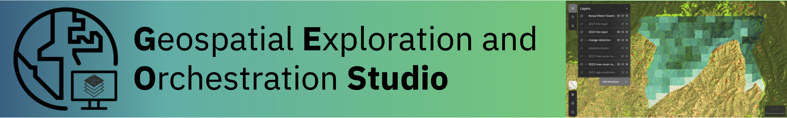
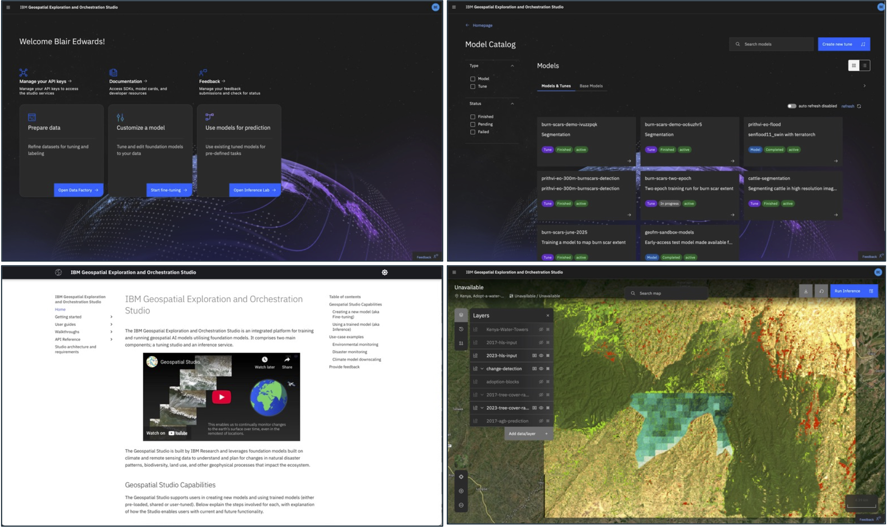

# 🌍 GEO Studio: UI


[](https://github.com/terrastackai/terratorch)
[](https://github.com/terrastackai/terrakit)
[](https://github.com/terrastackai/iterate)


[](https://terrastackai.github.io/geospatial-studio)

---

## 🚀 Overview

The Geospatial Studio UI provides "no code" access to the power of geospatial AI as a web-based interface to the Geospatial Studio. The UI connects to a deployed instance of the Geospatial Studio backend, providing users access to dataset onboarding and management, model fine-tuning and deployment and running inference at scale.



For details on deploying the UI (usually done alongside the studio backend), [see here](https://github.com/terrastackai/geospatial-studio).

## 💻 Getting Started

Instructions for getting started with the UI, as well as end-to-end walkthroughs can be found in the [📒 studio docs 📒]()

## 🛠 Developing

To start developing, you only need the following installed:

- Podman/Rancher/Docker
- `npm`
- `jq`

Then, clone this repo and in the repo root directory:

- Run `cp deploy/instances/dev-template.env deploy/instances/dev.env`
- Configure the environment variables as documented in `deploy/instances/dev.env`
- NB: Do not commit `deploy/instances/dev.env` file to GitHub
- Run `./copy-libs.sh` to copy core third party libraries from node modules into the `libs` folder. (Cesium is already present in `lib` as it contains custom styling changes that would be overwritten by copying from node modules).
- Run `npm run build` to build a dev environment docker image on the local machine
- Run `npm run start` to run the dev image using the dev environment. This mounts the `/app` source code directory into the previously-built image so that you can make code changes and refresh the browser to see the changes.
- Open your browser to `http://localhost:9090` to see the app

Note that you don't need to re-run the `npm run build` step in future, unless there are changes in the `/deploy` folder (e.g. nginx config changes).

### Carbon Web Components

This project uses Carbon Web Components. The documentation for the various `bx-` tags can be found here:

[https://web-components.carbondesignsystem.com/](https://web-components.carbondesignsystem.com)

SVGs for the Carbon Icons can be found here:

[https://carbondesignsystem.com/guidelines/icons/library/](https://carbondesignsystem.com/guidelines/icons/library/)

In addition, "Carbon for IBM" defines higher-level UI features that can be used as part of IBM product development, which is documented here (but not yet included in this project):

[https://www.ibm.com/standards/carbon/web-components/](https://www.ibm.com/standards/carbon/web-components/)

### 🗂 Folder Structure

This project seperates custom Web Components into **Page Files** and **Component Files**.

- **Page Files** (`app/js/pages/`) are the root files for each page in the studio .
- **Component files** (`app/js/components/`) are then imported into these page files.

The components folder contains a set of sub folders that each correspond to a specific page in the studio. For example, the `data-set-factory` folder contains the components used in `app/js/pages/dataset-factory-page.js`. Some pages and component folders contain files which are still a work in progress and not yet featured in the studio. These folders/files have been marked 🚧 Work in progress 🚧 below.

Files shared across multiple pages live directly in `app/js/components` without an additional directory—for example, `app/js/components/dataset-settings-form.js`.

```
app/
└── js/
├── components
│ ├── app-backend.js
│ ├── app-progressbar.js
│ ├── breadcrumb-button.js
│ ├── data-catalog/
│ ├── dataset/
│ ├── dataset-settings-form.js
│ ├── delete-modal.js
│ ├── error-handler.js
│ ├── feedback/
│ ├── fine-tuning-create/
│ ├── home-page/
│ ├── inference/
│ ├── login-widget.js
│ ├── model/
│ ├── model-catalog/
│ ├── refresh-timer.js
│ └── user-profile.js
├── icons.js
├── index.js
├── pages
│ ├── data-catalog-page.js
│ ├── dataset-page.js
│ ├── feedback-page.js
│ ├── fine-tuning-create-page.js
│ ├── home-page.js
│ ├── inference-page.js
│ ├── model-catalog-page.js
│ ├── model-page.js
│ └── not-found-page.js
├── router.js
├── utils.js
└── webcomponent.js
```

### 📑 File Structure

This project uses a custom **Web Components Library**. All pages and components extend the base class defined in `app/js/webcomponent.js`.

Each JavaScript file typically follows this structure:

```javascript
import asWebComponent from "app/js/webcomponent.js"; /* Must be imported for every webcomponents file */

const template = (obj) => /* HTML */ `
  <style>
    /* Component styles here */
  </style>
  <div>/* Component HTML here */</div>
`;

window.customElements.define(
  "my-component" /* Custom component name */,
  class extends asWebComponent(HTMLElement) {
    init() {}

    render() {
      this.setDOM(template(this));
    }

    /* Component methods here */
  }
);
```

## Third party libraries

Third party libraries are stored in `app/js/libs`. To keep track of dependency versions and vulnerabilities, the libraries can be installed via npm
and then copied from node_modules to the correct location using `copy-libs.sh` script. You should copy only the compiled/minified files that you need, usually in the `dist` folder.

### Cesium

This project uses Cesium for the main inference page map. Some of the Cesium styles have been changed to allow for better visual intergration into the studio.

> **Note:** Running `copy-libs.sh` will overwrite `app/js/libs/cesium/Widgets/widgets.css`.
> To preserve custom styles, **do not commit** changes to this file.
