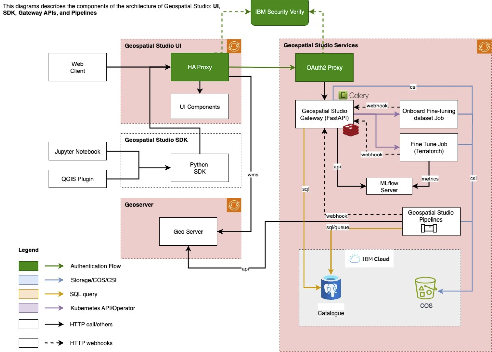

# Geospatial Studio Platform Architecture

## Platform architecture
The IBM Geospatial Exploration and Orchestration Studio is a platform formed of an core backend API and services, pipelines, UIs and catalogues deployed on top of Red Hat OpenShift or Kubernetes.

## Dependencies

### Software requirements

| Software | Purpose | Part of GS deployment | Notes |
| -------- | ------- | ---- | ----- |
| Red Hat OpenShift *or* Kubernetes | Underlying platform environment | N | This will involve creating namespaces, cluster roles and permissions, and configuring GPU drivers |
| MLflow | Logging and serving model training metrics | Y |  |
| Geoserver | Rendering and serving geospatial data for visualization | Y |  |
| Postgresql | Database for Studio metadata | Optional | Cloud native PostgreSQL is part of studio deployment but DBaaS (Database as a Service) is not. |
| OAuth2 Authenticator | User authentication for the platform  | Optional | ISV (see below) is used as default, but can be configured to use another external service, or could be deployed using the onboard OpenShift authenticator or a service deployed on the cluster.  |
| Object Storage | The primary storage+archive layer for Studio data and artifacts  | Optional | Could be an external service such as IBM Cloud Object Storage, or deployed on cluster through a tool such as Cephfs or Minio.  |

### Optional subscriptions and dependencies
| Service/software | Purpose | Link | Notes |
| -------- | ------- | ---- | ----- |
| Mapbox | Access to basemap layers for UI visualization |  | External service subscription  |
| Sentinel Hub | Access to EO data from full time and space archive |  | External service subscription |

## Deployment

The Geospatial Studio is designed primarily to be deployed on a cluster running Red Hat OpenShift or Kubernetes, with access to NVIDIA GPUs.  For development and testing purposes, it can also be deployed locally, although the functionality and performance may be limited.

The deployment scripts and the [instructions for both cluster and local deployment can be found here](https://github.com/terrastackai/geospatial-studio).

<!-- 
## Compute Requirements
The compute requirements for a deployment of the Geospatial Studio will depend on the scale of the deployment required, but at minimum you need access to GPU nodes.   -->

