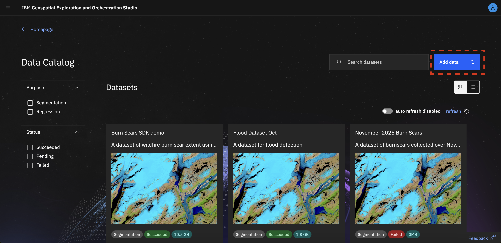
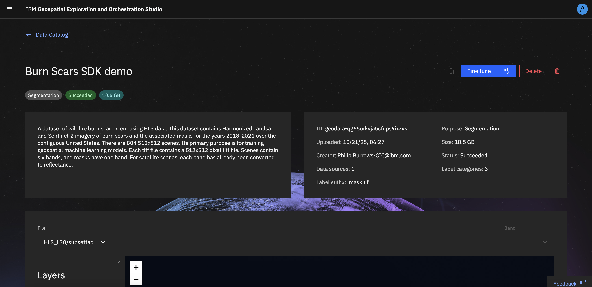
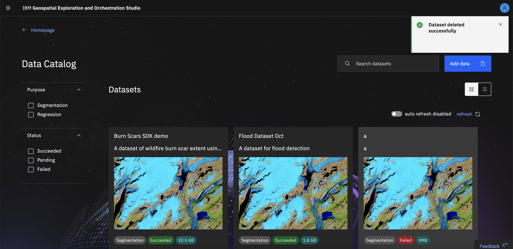
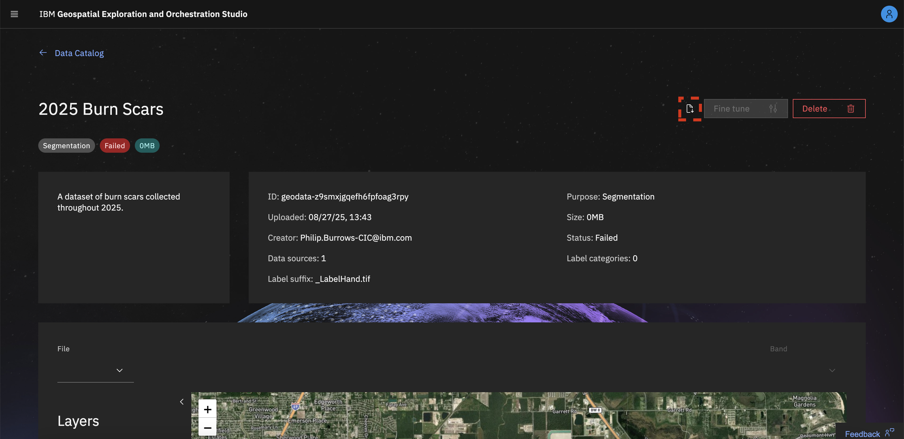

# Geospatial Studio Dataset Factory

## Overview 

The **Dataset Factory** allows users to onboard their curated data to the Geospatial Exploration and Orchestration Studio for fine-tuning. During the onboarding process, the **Dataset Factory** obtains all images and labels from the user-provided URL and randomly splits all image-label pairs into `train`, `test`, and `validation` groups using a `60%`, `20%`, `20%` distribution, respectively. In addition, during onboarding, the **Dataset Factory** calculates the essential training parameters for fine-tuning, so that users do not need to provide those themselves.

Once a dataset is successfully onboarded, users could select the particular dataset for their fine-tuning tasks.

## How to onboard a dataset

In the **Dataset Factory**, click on the **Add file +** button.

This will open a form to start providing information on the dataset. To start with, we just need to provide some basic information on the type of upload (initially just `Dataset & Labels`), the purpose of the dataset (e.g. `Regression`, `Segmentation`), a link to the dataset (as a zip file), and lastly the suffixes which identify the data and label files. After completing this information, you can click the **Pre-scan dataset** button. This will run a scan of the zip file to check that you have a matching set of data and labels (i.e. the same number of each, with matching filestems) and extract the number of bands in the input data (and band name if that is included in the tifs). This should only take a few/tens of seconds to run. If successful, you will get a confirmation and then click `Configure dataset` to move to the next step.

_NB: depending on where the zip file is being served from, you may not be able to run the pre-scan. You can still continue the onboarding process, but you will have to manually add the number of bands, and any issues with mismatched data/labels will show up during onboarding._

You will now be asked to give the dataset a name and description, and provide any additional information on the data sources. If the dataset was pre-scanned, information on the data sources and bands will have been pre-filled, if not, you will have to manually edit this panel.

To add a data source, select "add data source" at the bottom of the configure dataset form. (*NB: in general, data is served through TerraKit, so the available data sources will be those available in TerraKit.*)  Select the data source from the drop down list, enter the file suffix and configure the bands. For the data source and bands, there will be a drop down list to choose from. (Data sources available through the studio)

Once you have entered the required information, select "Configure labels" to proceed. Depending on the purpose type you selected in the add file form, you may be given the option to enter label categories.

To add a label category, select "add label" in the configure labels form. This will add a blank label. Enter the Label ID, Label Name, Color and Opacity. To remove a label, select the "delete" action.

Once you have configured your labels, (depending on purpose type) click the **Submit** button.

You will recive a notification alerting you that your file has been successfully uploaded. You can now monitor the progress of your file as it onboards via the status field in the dataset table.

## The Dataset Page

Clicking on a dataset card opens the **Dataset Page**, where you can view all detailed information related to that dataset. This includes the dataset description and onboarding status, as well as basic information about data sources and label categories.

From this page, you can also access a set of dataset-specific actions, such as Fine-tune, Delete, and Download Logs.

A preview of the dataset is shown at the bottom of the page, allowing you to quickly inspect sample images and their corresponding labels.

## How to fine-tune a dataset

Click the dataset card to open the **Dataset Page**. In the top-right corner, select the **Fine-tune** button.  
This will open the **Create New Tune** form, with both the task and dataset fields already pre-populated based on your selection.

You can find out more about the fine-tuning process [here](./tuning-studio.md).

## How to delete a dataset

Click the dataset card to open the **Dataset Page**. In the top-right corner, select the **Delete** button.  
You will be prompted to confirm that you want to delete the dataset.  
Once confirmed, a toast notification will appear indicating that the dataset has been successfully deleted.

## How to download logs

If a dataset has failed onboarding, you can download the onboarding logs to review the issue.  
Click the dataset card to open the **Dataset Page**. In the top-right corner, select the **Download Logs** button.  
Your download will begin automatically.

## How to preview a dataset

The dataset preview is located at the bottom of the **Dataset Page**.

Use the file dropdown or the pagination to move through the preview images.

You can hide and show layers for each image in the layers panel by clicking the visibility icon.

