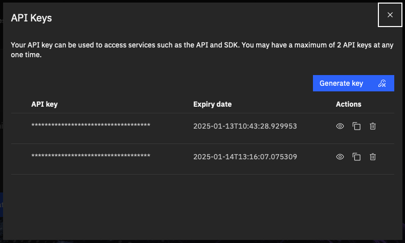

# Getting started with the Geospatial Studio SDK

*NB: This SDK leverages a deployed instance of the Geospatial Studio through the studio APIs.  As a result, you will require access to an instance.  If you do not, see the previous page.*

In order to support users to interface with the Geospatial Studio through the APIs in a more natural manner, we have created a python SDK.

You can view the SDK documentation [here](https://terrastackai.github.io/geospatial-studio-toolkit)

## Prerequisites
1. Access to an instance of Geospatial Studio platform
2. Ability to run and edit a copy of our jupyter notebooks
 
## Installation
1. Prepare a python 3.11+ environment, however you normally do that (e.g. conda, pyenv, poetry, etc.) and activate this new environment.

2. Install Jupyter into that environment: 
   ```bash
   python -m pip install --upgrade pip
   pip install jupyterlab
   ```

2. Install the SDK:
    * Download and install the SDK from wheel and replace `<x.y.z>` with the downloaded version of the sdk:
      ```bash
      wget --content-disposition https://ibm.biz/geostudio-sdk
      pip install geostudio-<x.y.z>-py3-none-any.whl
      ```

## Authentication

Authentication to the Geospatial Studio is handled by a redirect in the UI, but for programmatic access (form the SDK, for example), the user will need to create an API key.  This is can be easily done through the UI.

1. Go to the Geospatial Studio UI page and navigate to the `Manage your API keys` link.
{style="display: block; margin: 0 auto" }

1. This should pop-up a window where you can generate, access and delete your api keys.  NB: every user is limited to a maximum of two activate api keys at any one time.
{style="display: block; margin: 0 auto" }

1. When you have generated an api key and you intend to use it for authentication through the python SDK, the best practice would be to store the API key and geostudio ui base url in a credentials file locally, for example in /User/bob/.geostudio_config_file. You can do this by:
    ```bash
    echo "GEOSTUDIO_API_KEY=<paste_api_key_here>" > .geostudio_config_file && echo "BASE_STUDIO_UI_URL=<paste_ui_base_url_here>" >> .geostudio_config_file
    ```

## Example usage of the SDK
In your Python Interpreter:
```py
from geostudio import Client

# change the value of geostudio_config_file below to the path of the file you saved your config in
gfm_client = Client(geostudio_config_file=".geostudio_config_file")

# list available models in the studio
models = gfm_client.list_models()
print(models)

# list available tunes
tunes = gfm_client.list_tunes()
print(tunes)
```

For more detailed examples on how to use the Geospatial studio SDK, check out [here](/sdk/) or see the examples linked below.

### Example notebooks
For detailed examples on how to use different components of the Studio, please checkout these sample notebooks:

| Notebook  | Description  |
|-----------| -------------|
| [Onboarding a Dataset](https://github.com/terrastackai/geospatial-studio-toolkit/examples/dataset-onboarding/001-Introduction-to-Onboarding-Tuning-Data.ipynb)  | Onboard your curated data to the IBM Geospatial Exploration and Orchestration Studio for fine-tuning  |
| [Fine-tuning a model](https://github.com/terrastackai/geospatial-studio-toolkit/examples/fine-tuning/001-Introduction-to-Finetuning.ipynb)  | Customize a base model by running a regression or segmentation task on the base model using labelled data as input |
| [Uploading completed tune artifacts](https://github.com/terrastackai/geospatial-studio-toolkit/examples/fine-tuning/002-Upload-Complete-Tune-Artifacts.ipynb)  | Deploying a completed fine-tuned TerraTorch model with both checkpoint (.ckpt) and configuration (.yaml) files to the GeoStudio platform  |
| [Hyperparameter Optimization](https://github.com/terrastackai/geospatial-studio-toolkit/examples/fine-tuning/003-Terratorch-Iterate.ipynb)  | Submit an HPO (Hyperparameter Optimization) job to the FineTuning service.  |
| [Running an inference](https://github.com/terrastackai/geospatial-studio-toolkit/examples/inference/001-Introduction-to-Inferencing.ipynb)  | Running different fine-tuned models to generate inferences on the provided datasets. |
| [Uploading pre-computed examples](https://github.com/terrastackai/geospatial-studio-toolkit/examples/inference/002-Add-Precomputed-Examples.ipynb)  | For inferences run outside the studio, you can onboard your layers to the studio for visulaisation  |

Alternatively, you can jump right into the End-to-end walkthrough notebooks:

| Notebook  | Description  |
|-----------| -------------|
| [Burn scars walkthrough](https://github.com/terrastackai/geospatial-studio-toolkit/examples/e2e-walkthroughs/GeospatialStudio-Walkthrough-BurnScars.ipynb)  | Map the extent of areas burned by wildfires |
| [Flooding walkthrough](https://github.com/terrastackai/geospatial-studio-toolkit/examples/e2e-walkthroughs/GeospatialStudio-Walkthrough-Flooding.ipynb)  | Map the extent of flooded areas  |

#### Fine-tuning templates

Below is a current list of the available task templates and compatible backbone models.  Fine-tuning leverages TerraTorch, so in theory any model available in TerraTorch can be supported with an appropriate config/template, more will be made available in future.

<table>
<tr>
  <th>Model family</th>
  <th>Backbone model</th>
  <th>Tuning template</th>
</tr>
<tr>
  <td>Prithvi</td>
  <td>
    <ul>
        <li> Prithvi_EO_V1_100M
        <li> Prithvi_EO_V2_300M
        <li> Prithvi_EO_V2_600M
        <li> Prithvi_EO_V2_600M_TL
        <li> <it>Prithvi tiny (coming soon)</it>
    </ul>     
  </td>
  <td>
    <ul>
     <li> Segmentation
     <li> Regression
    </ul>  
  </td>
</tr>
<tr>
  <td>Terramind</td>
  <td>
    <ul>
        <li> terramind_v1_large
        <li> terramind_v1_base
    </ul>     
  </td>
  <td>
    <ul>
     <li> terramind: Segmentation
    </ul>  
  </td>
</tr>
<tr>
  <td>Clay</td>
  <td>
    <ul>
        <li> clay_v1_base
    </ul>     
  </td>
  <td>
    <ul>
     <li> clay_v1: Segmentation
    </ul>  
  </td>
</tr>
<tr>
  <td>ResNet</td>
  <td>
    <ul>
        <li> timm_resnet152
        <li> timm_resnet : Segmentation
        <li> timm_resnet101
        <li> timm_resnet50
        <li> timm_resnet18
        <li> timm_resnet34
    </ul>
  </td>
  <td>
    <ul>
     <li> clay_v1: Segmentation
    </ul>  
  </td>
</tr>
<tr>
  <td>Convnext</td>
  <td>
    <ul>
        <li> timm_convnext_xlarge.fb_in22k
        <li> timm_convnext_large.fb_in22k
    </ul>
  </td>
  <td>
    <ul>
     <li> timm_convnext : Segmentation
    </ul>  
  </td>
</tr>

</table>
