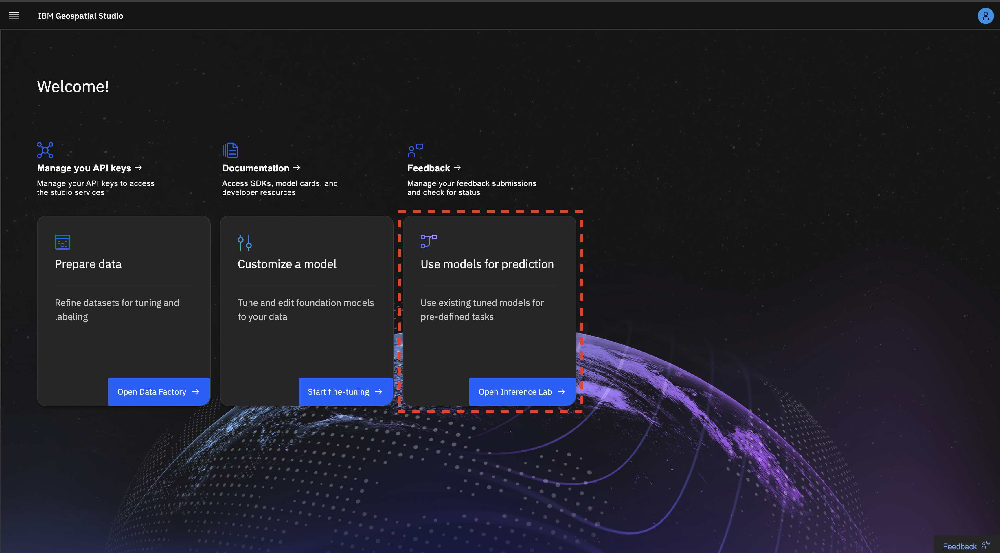
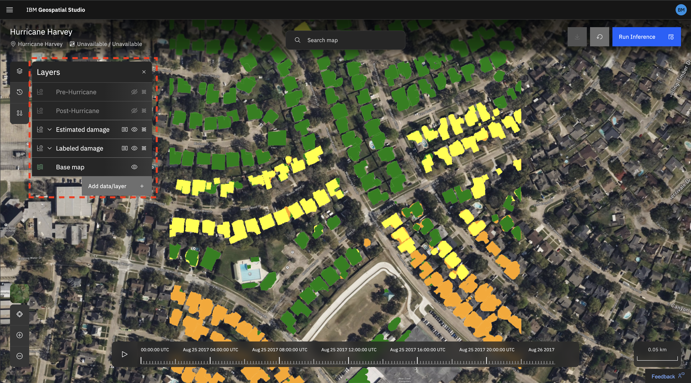

# Getting started with the Geospatial Studio UI

## Access to the Geospatial Studio Platform

You will require access to an instance of the Geospatial Studio.  If you do not already have access to a deployed instance, you can find deployment [instructions for local and cluster deployment here](https://github.com/terrastackai/geospatial-studio).

## Getting started with pre-computed examples

You can start getting familiar with the studio by exploring the pre-computed inference examples for different locations and different down-stream tasks.

1. Once on the Geospatial Studio main page, select the Open Inference Lab button from the Use models for prediction box.

2. Navigate to the examples button on the left panel and select an example to view.

Once you select an example to explore, you can explore it's layers by toggling the view buttons on the left panel on and off, as shown below:

## Try out inference using a deployed model
To get started with running an inference of your own, check out the Geospatial Studio UI [inference guide page.](inference-lab.md)