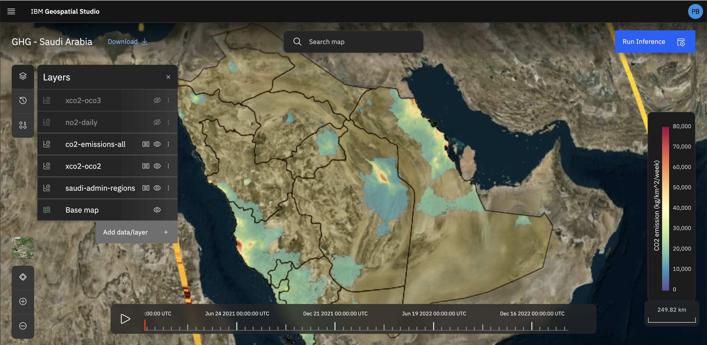

<!-- # Geospatial Inference Service -->

# Inference Lab

## Overview 

The **Inference Lab** is no-code portal for running inference with different fine-tuned models, and visualize the results.  A user can select a model, a spatial domain and temporal range, and the studio backend will do the rest.

## How to run an Inference 

### Running inference modalities

We have defined two modalities of running a new inference depending on the source of the input dataset.

#### Query existing data

You can set-up a new inference by sourcing the input data from existing IBM datasets. In this case you supply the location name and the tool will zoom to the selected location, you can further refine the zoom to focus on the particular area you want. You also provide the fine-tuned model you want to run inference against. Lastly you select the start data and end date within which the input data is to be bound.

#### Use pre-signed url(s)

Lastly, you can also provide comma separated pre-signed urls pointing to input tif files for running the inference. You also provide the fine-tuned model you want to run inference against as well as the name of the location.

### Check data availability

Before running an inference, you can check if data is available for the dates you selected by clocking on the **Check date availability** button on the inference panel. This will return a message notification on the screen if data was found for the dates you selected, and if not, give a list of alternative dates where data is available.

### Interacting with map layers

When an inference is loaded on the map view, an interactive graphic is presented, where you can show or hide layers. For layers which have categorical labels, these can be viewed by expanding the layer box (in the layer panel), for layers which have continuous values, a colorbar should be shown on the right. To extract information about the data in the layers, you can click on any point and a pop-up should show the information about the values associated for all visible layers for that location.

In general the following layers are presented:

1. Satellite basemap - this is the MapBox base satellite base map
2. Model input - this shows the raster file that was input to the inference engine
3. Model prediction - this shows the different categories that are identified by the fine-tuned model

The layers may also include information on assets, impacts, change etc, it will depend on the particular model and inference pipeline which has been run.

### Interacting with timeline

When an inference is loaded on the map view, an interactive graphic showing the timeline is presented at the bottom (if there is a time dimension to the layer). You can load the layers for each timestamp by clicking on it. You can play the timeline to animate the timesteps available for the visible layers (NB: currently the rate is fixed, but this will be updated in future). You can additionally, click/drag along the timeline to select the timestep to visualise.

### Interacting using the two-panel split screen slider

When an inference is loaded on the map view, two images can be loaded with a slider to swap between the layer. To activate the slider, click on the slider button next to the layer name. This will then toggle between left panel, right panel, or off. If a layer does not have it selected it will remain visible in the background.

### History

You can as well view your latest 25 inferences in the history section and can load them by clicking on them.

## Inference tips 

- When running an inference with query data modality, ensure you do not select wide date ranges to run inference on, to avoid stalled jobs that take a long time.

- When running an inference with query data modality, ensure the map zoom area is not more than 800km2 and not less than 5km2. This is roughly equivalent to a scale range of 100m - 2km that is presented at the bottom left corner of the map.

- When running inference with the uploading image modality, ensure the image size is small to avoid exhausting your workstation browser memory.
