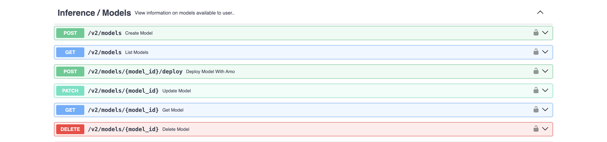
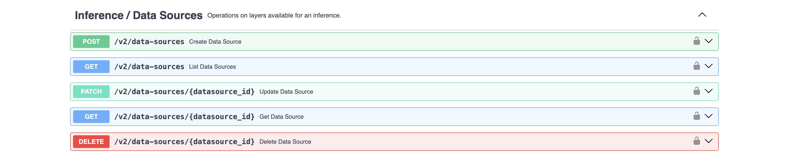
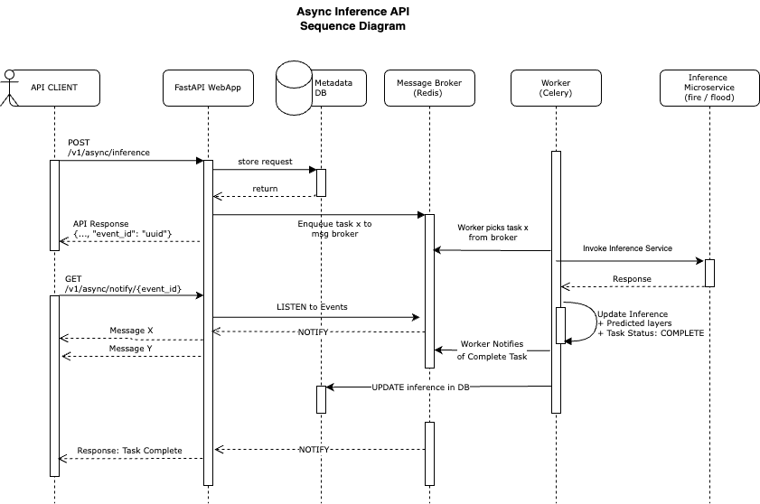

# Geospatial Studio Inference APIs

The Geospatial Studio Inference service is designed to allow users to easily perform inference using fine-tuned models from geospatial foundation models.

There are a variety of endpoints the user can access and they are grouped below:






## Authentication

For authentication to the API, can use an API key ([created and managed in the UI](getting-started-SDK.md#authentication) or through the API swagger page).  To authenticate pass the API key in the header as below:

```bash
{
    "Content-Type": "application/json",
    "X-API-Key": "<API key here>",
    "x-request-origin": "python-sdk/",
}
```

## Inference workflow

### Submitting an inference
When a user wishes to perform inference, they can either use a permanently onboarded model or onboard their own fine-tuned model. Check the [fine-tuning APIs page](fine-tuning-service.md) for how to run inference on a fine-tuned model.

Run inference using a permanently onboarded model  (HTTP POST request): `/v2/inference/`


In this endpoint they will need to specify the following through either the UI, SDK or API:

- **Model display name** - what model to use for inference. i.e. `prithvi-eo-flood`, etc. Available models can be found using the models endpoint as described in the section below
- **Spatial domain** - Bounding box coordinates for the area of interenst to run the inference on.
- **Temporal domain** - The dates for the time period(s) of interest. These dates can be provided as a range or individual dates. i.e `2024-07-25_2024-07-27` or `2024-07-25`

A payload for the api might look like this:

```json
{
	"model_display_name": "prithvi-eo-flood",
	"description": "Jarani, Nagaon, Nagaon, Assam, India",
	"location": "Jarani, Nagaon, Nagaon, Assam, India",
	"spatial_domain": {
			"bbox": [
					[92.40665153547121, 26.1051042015407,92.92535070071905,26.498933088370826]
			]
	},
	"temporal_domain": [
			"2024-07-25_2024-07-27"
	]
}
```

The input fields are explained below. Required fields are marked with a "*":


- `model_display_name`* : Model to use for inference. Options can be found from the list models endpoint
- `spatial_domain`*: The area of interest to run the inference on. You can either provide a bounding box in the format [min_lon, min_lat, max_lon, max_lat], a polygon, tiles, or a url link to tiff files.
- `temporal_domain`*: The dates for the time period of interest. Each date provide should be in the format: 'YYYY-MM-DD'.
- `location`: Location name.
- `description`: Brief description of the inference you are running.

When the user makes the request to the endpoint, the API uses the following steps:

1. Get the payload and user information
2. Pull default values from models database for pre/post-processing data
3. Communicate with the dataservice for data pre-processing
4. Communicate with the specified model's inference service to execute inference
5. Communicate with the dataservice for data post-processing
6. Return the location of the inference output files

#### Request types

There are four different options for spatial domain when making a request: `bbox`, `polygon`, `tiles`, and `urls`.

##### Bounding box request

With the `bbox` request type, users can specify an area of interest on which to run inference using bounding box coordinates in the format `[min_lon, min_lat, max_lon, max_lat]`. 


Sample request:
```
{
	"model_display_name": "prithvi-eo-flood",
	"description": "Jarani, Nagaon, Nagaon, Assam, India",
	"location": "Jarani, Nagaon, Nagaon, Assam, India",
	"spatial_domain": {
			"bbox": [
					[92.40665153547121, 26.1051042015407,92.92535070071905,26.498933088370826]
			]
	},
	"temporal_domain": [
			"2024-07-25_2024-07-27"
	]
}
```


##### Url request

The `url` request type requires the user to provide pre-signed URLS to links to one of the following input types:

- .tif
- .zip containing .tif file(s)
- folder containing .tif file(s)

The data provided in each tif file must be in the correct format for the specified model. See Input data section for more details.

Sample request:

```
{
	"model_display_name": "prithvi-eo-flood",
	"description": "Jarani, Nagaon, Nagaon, Assam, India",
	"location": "Jarani, Nagaon, Nagaon, Assam, India",
	"spatial_domain": {
			"urls": [
					"pre-signed url 1", "pre-signed url 2", ...
			]
	}
}
```

### Inference Request Flow

#### Sequence Diagram



#### Initial Inference Request

1. API client makes a request to `POST /v2/async/inference` to run an inference task.
2. The request details are stored in a Database and state marked as `PENDING`.
3. The requests is published to a message broker (Redis).
4. API client gets back a reponse object. The response object includes an inference `id`, the user input submitted, among other fields:

    ```json
    {
        "id": "<uuid>",
        ...
    }
    ```

#### Background Tasks

After step 3 in the *Initial Inference Request*, the users gets back the response in step 4 but the following steps continue in the background.

5. A celery worker retrieves the inference request object published in step 3 from the message broker.
6. The celery worker makes an inference call to the downstream inference services.
7. The inference services make their predictions and return the response to the worker.
8. The worker gets the reponse, updates the DB records that was created in step 2. with a `COMPLETED`/`ERROR` state and adds the predicted layers.
9. The worker publishes the result from the inference run to the message broker.


#### Event Listeners

After step 4 in the *Initial Inference Request*, a client could opt to use our **(SSE) Server Sent Events** endpoint to listen to changes/updates from the inference tasks.

10. Use the `event_id` from step 4 to register for events like so:

    ```
    GET /v2/notifications/{event_id}
    ```

    This will send real time messages and tasks status untill the inference task is complete.

11. The SSE endpoint `GET /v2/notifications/{event_id}` listens to inference messages on the channel associated with the `event_id` in the message broker.
12. The client gets notified every time an event occurs until the inference tasks in completed.