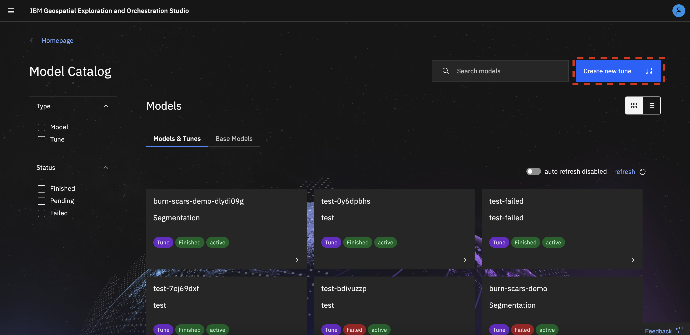
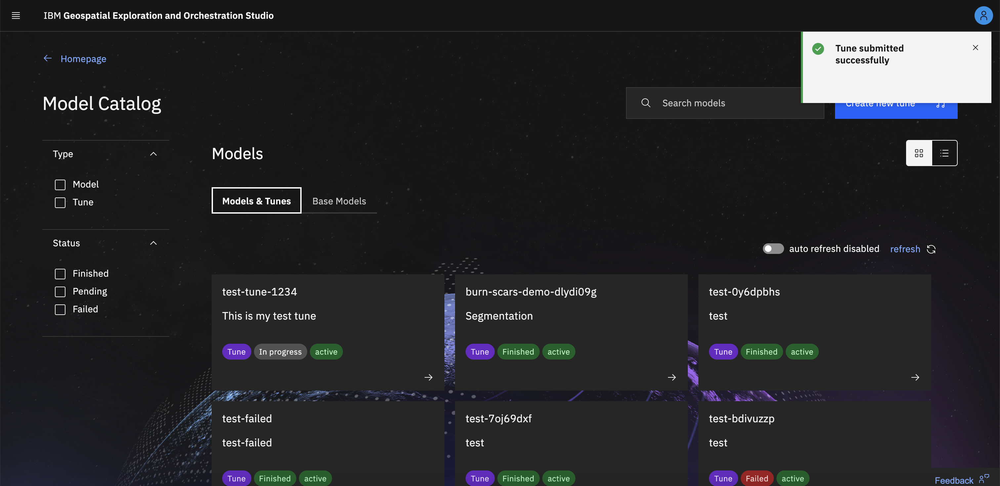
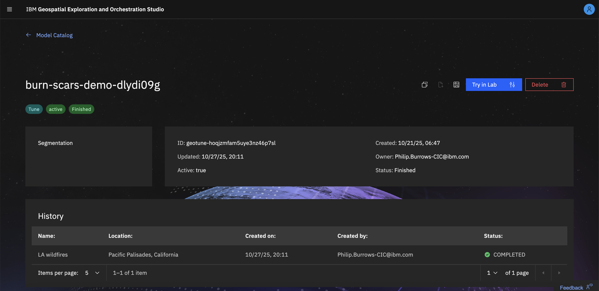
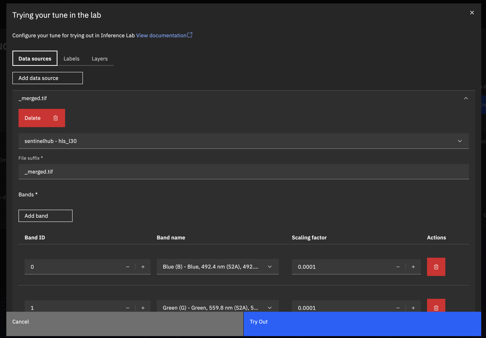
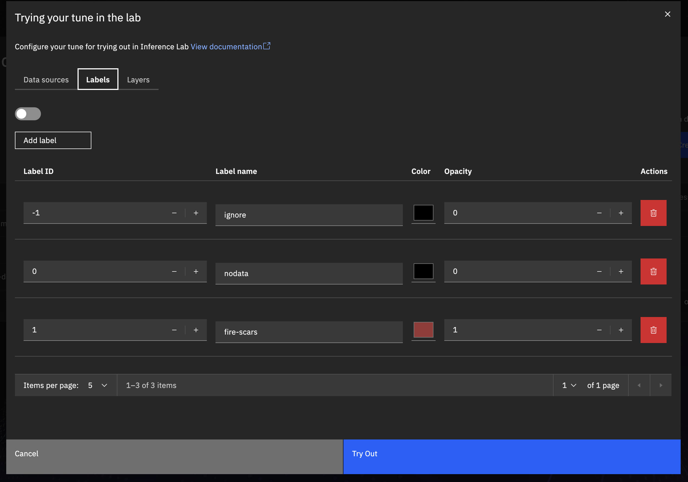
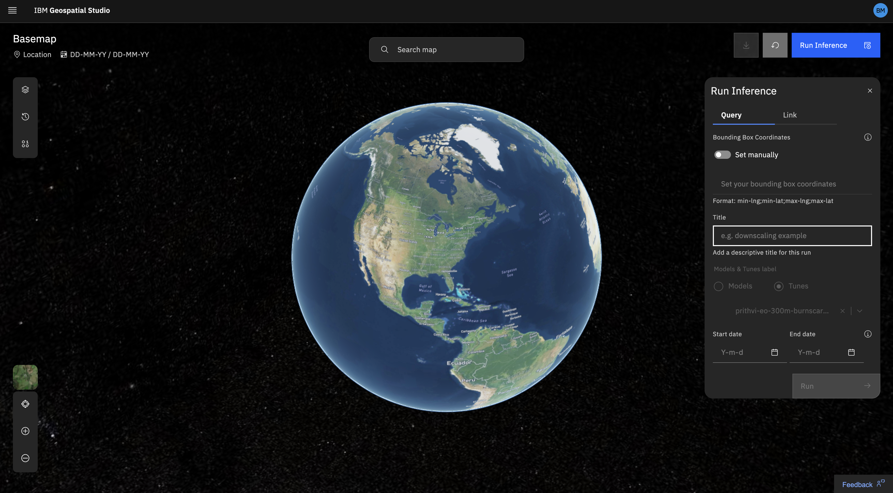
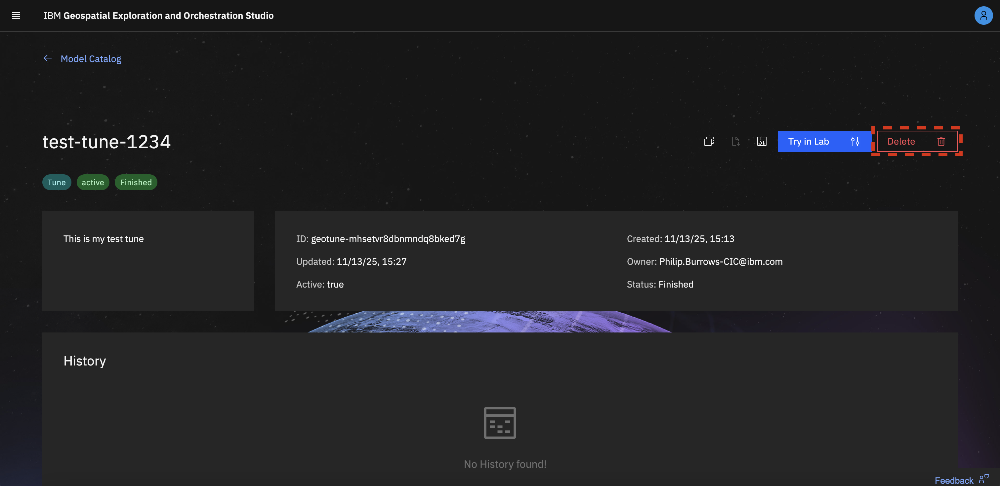
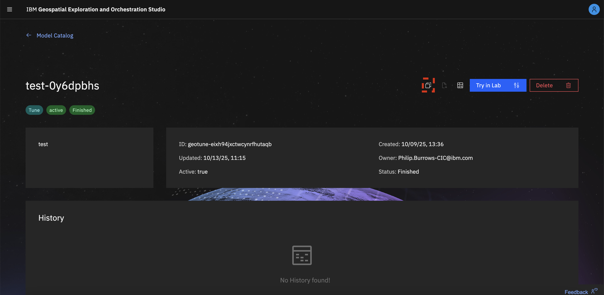

# Tuning Studio

## Overview 

The Geospatial Tuning Studio provides users with a no-code way to create fine-tuned models for specific applications.  The user will select the *type of task* they wish to carry out, the labelled *tuning dataset* and the pre-trained *backbone model* they wish to start from.  The resulting tuned model can be tried out or permanently deployed to the inference service.

## How to tune a model 

In the **Fine-tuning Studio** Studio, click the **create new tune**.

### Set-up your tune

Enter your tune name and description and select the config template to use (e.g Regression, Segmentation, etc). This will return a list of base foundation models most suitable for your task in the next dropdown. Then select "next".

### Select your dataset

Select your dataset. After selecting your dataset from the list in onboarded in the studio, a list of data sources and their bands configured will appear below. You can verify this configuration and make appropriate edits if necessary. Then click "Next".

### Set the tune parameters

We have selected default parameters that work for most use cases. We recommend adjusting the parameters in case your tuned model does not work as expected.

To adjust parameters, navigate through the tabs that appear and adjust accordingly.

Once you are ready to review, select "next".

### Review your selections and submit the tune

Review the tunes basic information and selected parameters. Once you are ready to sumbit the tune, select "Create tune".

You will receive a notification alerting you that your tune has been successfully submitted.

You can now monitor the progress of your tune as it onboards via the status field for the tune in the model catalog.

### The Model Page

Clicking on a model/tune card opens the **Model Page**, where you can view all detailed information related to that model. This includes the model description and onboarding status, as well as other basic information.

From this page, you can also access a set of model-specific actions, such as Try in Lab, Delete, View metrics and more.

There is a history table showing all inference runs made using this tune.

There are also graphs for both _Tune_ and _Train_ metrics at the bottom of the page

### Trying your tune in the lab

Click the model/tune card to open the **Model Page**. In the top-right corner, select the **Try in Lab** button.

A pop-up will open for you to configure your data sources, labels and layers for the inference. This should be pre-configured from the dataset you selected.

- **Data source** - the details of the name of the data source (e.g sentinelhub), collection to be used
- **File suffix** - the file suffix of the training data tiffs.
- **Bands** - a list of which bands to scale with the scaling factor (i.e. sum might not need to be scaled if they are from a different source, or a cloud mask etc).
- **Label categories** - Information about the labels of the dataset (name, colors to use for each label, opacity)
- **Layers** - e.g Input image(RGB) and model prediction. And configurations you can set for each layer (e.g z index, RGB max value an ddisplay name)

You will be redirected to the inference lab where you can select the area time (as with a regular inference).  This will trigger an inference pipeline run which will load the model checkpoint (so may take slightly longer than for a deployed model).   and you can monitor progress in the status page.

## How to delete a tune 

Click the model/tune card to open the **Model Page**. In the top-right corner, select the **Delete** button.
You will be prompted to confirm that you want to delete the model.  
Once confirmed, a toast notification will appear indicating that the model has been successfully deleted.

## How to download logs

If a tune has failed onboarding, you can download the onboarding logs to review the issue.  
Click the model/tune card to open the **Model Page**. In the top-right corner, select the **Download Logs** button.  
Your download will begin automatically.

## How to duplicate a tune

Click the model/tune card to open the **Model Page**. In the top-right corner, select the **Duplicate** button.  
This will open the **Create New Tune** form, with both the task and dataset fields already pre-populated based on your selection.

## How to view a tunes run history

Click the model/tune card to open the **Model Page**.  
Below the description and general information section, you will find the **History** table.  
This table displays a record of all inference runs made using the model.

Selecting a specific run will open it in the **Inference Lab** for detailed inspection.

## Tuning Methods 

We currently only support fine-tuning which involves updating the pre-trained model parameters based on the training data provided. This creates a tuned copy of the pre-trained model that it is optimized to perform well on a given task.

*NB: tuning with a custom config can be performed through the API and may be supported by the UI in future.*

Below is a current list of the available task templates and compatible backbone models.  Fine-tuning leverages TerraTorch, so in theory any model available in TerraTorch can be supported with an appropriate config/template, more will be made available in future.  The UI should show only templates compatible with a given backbone.

<table>
<tr>
  <th>Model family</th>
  <th>Backbone model</th>
  <th>Tuning template</th>
</tr>
<tr>
  <td>Prithvi</td>
  <td>
    <ul>
        <li> Prithvi_EO_V1_100M
        <li> Prithvi_EO_V2_300M
        <li> Prithvi_EO_V2_600M
        <li> Prithvi_EO_V2_600M_TL
        <li> <it>Prithvi tiny (coming soon)</it>
    </ul>     
  </td>
  <td>
    <ul>
     <li> Segmentation
     <li> Regression
    </ul>  
  </td>
</tr>
<tr>
  <td>Terramind</td>
  <td>
    <ul>
        <li> terramind_v1_large
        <li> terramind_v1_base
    </ul>     
  </td>
  <td>
    <ul>
     <li> terramind: Segmentation
    </ul>  
  </td>
</tr>
<tr>
  <td>Clay</td>
  <td>
    <ul>
        <li> clay_v1_base
    </ul>     
  </td>
  <td>
    <ul>
     <li> clay_v1: Segmentation
    </ul>  
  </td>
</tr>
<tr>
  <td>ResNet</td>
  <td>
    <ul>
        <li> timm_resnet152
        <li> timm_resnet : Segmentation
        <li> timm_resnet101
        <li> timm_resnet50
        <li> timm_resnet18
        <li> timm_resnet34
    </ul>
  </td>
  <td>
    <ul>
     <li> clay_v1: Segmentation
    </ul>  
  </td>
</tr>
<tr>
  <td>Convnext</td>
  <td>
    <ul>
        <li> timm_convnext_xlarge.fb_in22k
        <li> timm_convnext_large.fb_in22k
    </ul>
  </td>
  <td>
    <ul>
     <li> timm_convnext : Segmentation
    </ul>  
  </td>
</tr>

</table>

## Tuning tips 

### Tuning configuration

- We recommend using the default parameters for your first tuning attempt and then adjusting based on performance.
