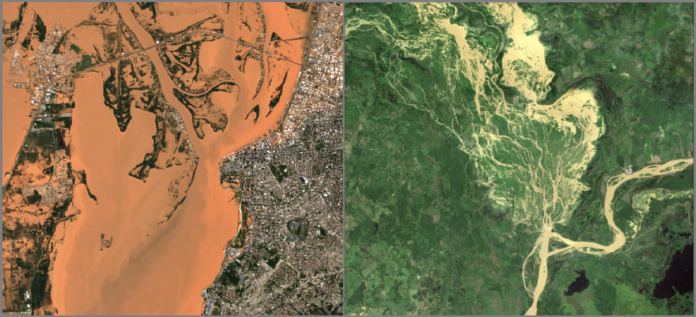
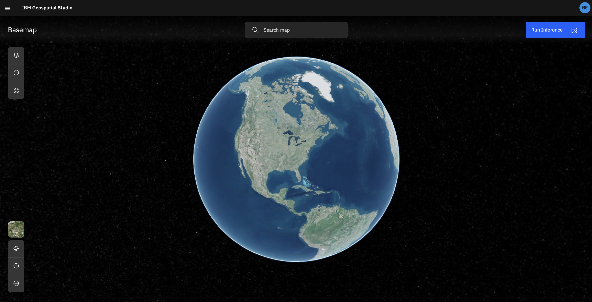
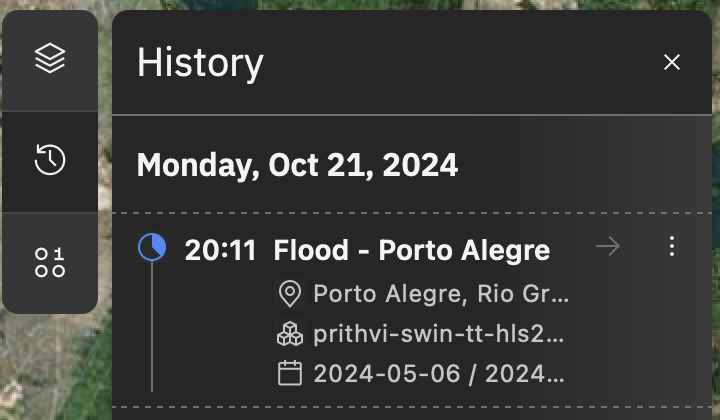
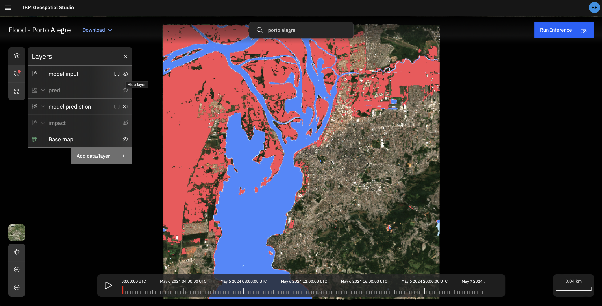

# Mapping flooding using an AI flood model

Assume you are interested in mapping flooding, traditionally you might have either relied on on-the-ground mapping, or possibly for manual analysis of remote-sensing imagery (i.e. satellite or UAV).  In order to scale up these efforts and operationalise, we need a way to automate the extraction of flood extent from satellite imagery.  This is where we turn to AI models.  The model you will use in this walkthrough was fine-tuned from the Prithvi foundation model and using the Sen1Floods11 dataset (link here).

*Flooding examples: Porto Alegre (Brazil) and Caro e Gato dike failure (Colombia), details below.*

## Generating a flood map using AI inference
1. Navigate to the Geospatial Studio main page, then select the `Open Inference Lab` button from the *Use models for prediction* box.

1.  You will be brought to the inference lab map view page.  To run a new inference start by clicking on the `Run Inference` button in the top right corner.

 
 
3. Now you will have two options to define the inference input data, either to pull it from a data archive (currently SentinelHub) or load from a pre-prepared geotiff file.  In both cases you need to give a descriptive `Title` for your inference run (so you can identify it in the list later) and you will need to select the `model`.  In this walkthrough we will use the `prithvi-swin-tt-hls2-us-flood-segmentation` model.  Then etither:
 
  * browse to the location you with to run the model for (the view window is the bounding box), select a time range, then let the studio do the rest.

  * if you have a pre-prepared data file for input, you can pass it directly.  In this case, you also can provide a location.  It is important that the input data matches the data source, bands and scaling of the original tuned model, otherwise inference either won't work, or give incorrect results.

4. Once you hit `RUN`, you should shortly see a pop-up above the panel saying `Inference Submitted`.  You should then also be able to see it in your inference history panel on the left hand side (under the clock icon).

5. Running an inference can take from about 30 seconds to a few minutes, depending on how large the area and time range for the input data are.  But once the inference is complete, you should be able to view it in the map view by clicking on the entry in the history panel (or it should autoload if you have stayed on the page.)

6. Now feel free to play around and try to map some other past flood events.  Some suggestions of events with good, timely, cloud-free imagery are listed below.

## Examples flood events

|  Location            |  Date    | Bounding box      |   News link     |
| :---------------------: | :--------: | :-----------------: | :--------------- |
|  Maiduguri, Nigeria  | 2024-09-12 | [13.146418, 11.799808, 13.215874, 11.871586]  |  https://www.aljazeera.com/features/2024/9/19/a-disaster-homes-lost-relatives-missing-in-floods-in-northeast-nigeria  |
|  Porto Alegre, Brazil  | 2024-05-06 | [-51.33225, -30.08903, -51.19011, -29.97489] |  https://www.reuters.com/pictures/stunning-images-show-extent-flooding-southern-brazil-2024-05-07/ | 
|  Montpelier, Vermont, USA  | 2023-07-11 | [-72.672966, 44.220703, -72.526882, 44.29103] |     |
| Ahero, Kenya | 2024-05-05 | [34.838652, -0.231379, 34.977847, -0.131439] |   |
| Gloucester, UK | 2024-01-09 | [-2.311807, 51.855573, -2.17892, 51.952735] |   | 
| Rockhampton, Queensland, Australia | 2024-04-08 | [150.401695, -23.440385, 150.599909, -23.261416] |  | 
| Caro e Gato, Colombia - Dike failure | 2024-07-01 | [-74.920077, 8.032594, -74.643089, 8.393184] |  |

## Challenges
Whilst the models performs well in most situations where good data exists, there are a few challenges associated with mapping floods using this type of model+data combination.  Some of these can be improved by using different (or a combination of) data sources.  Some limitations to be aware of are:
* the Sentinel2 imagery is optical, which means it is obscured by cloud cover.  This can often prove a challenge, especially for applications such as flood mapping.  It is often worth checking the cloud-free data availability for such an event using a service like the [Sentinel Hub EO Browser](https://apps.sentinel-hub.com/eo-browser/).  Such support will be integrated with the Geospatial Studio in the near future.
* As satellites orbit the Earth they take images as they go, but they do not have full coverage of the globe at all times.  This can introduce another challenge for dynamic, potentially short-lived events such as floods which could potentially be missed between satellite passes.

