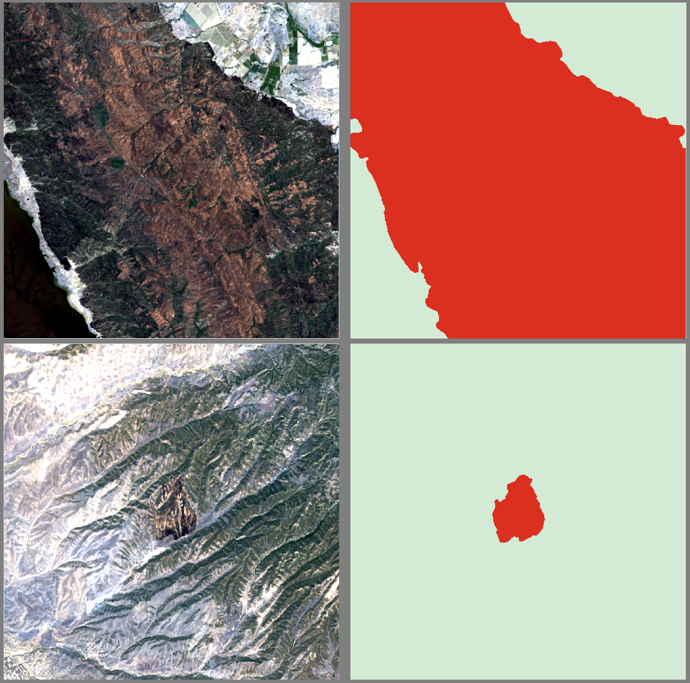
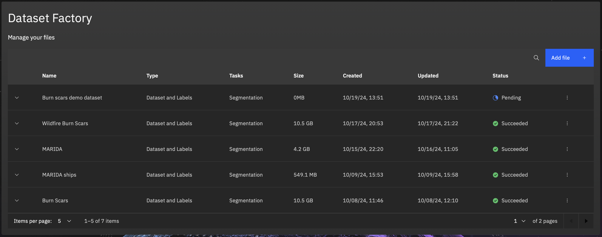
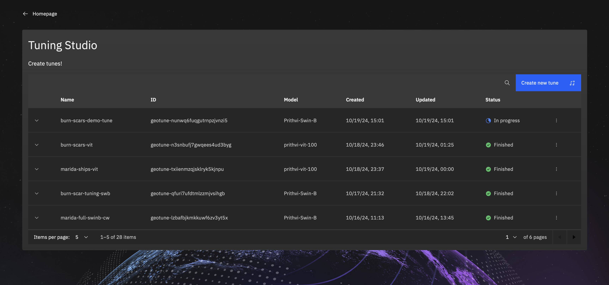
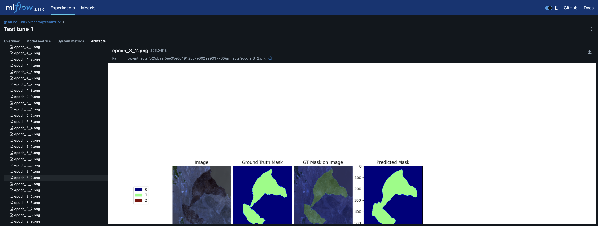

# Mapping wildfire burn scars using HLS data

Imagine that you work in disaster response and need a rapid way to map the extent areas burned by wildfires.  You need to do this in an automated, scalable manner.  We can achieve this using an AI model which ingests satellite data (in this instance the NASA Harmonized Landsat Sentinel2 dataset) and outputs a map of burned area.  We can then integrate the burned area extent with details of infrastructure or assets to quantify impact.

In this walkthrough we will assume that a model doesn't exist yet and we want to train a new model.  We will then show how to drive the model to map impact.

The steps we will follow are:
1. Onboarding our training data to the studio
2. Tuning a new model
3. Checking model performance
4. Using the model to assess impact

### Get the training data
To train the AI model, we will need some training data which contains the input data and the labels (aka ground truth burn scar extent).  To train our model we will use the following dataset: https://huggingface.co/datasets/ibm-nasa-geospatial/hls_burn_scars

We can download it [**here**](https://s3.us-east.cloud-object-storage.appdomain.cloud/geospatial-studio-example-data/burn-scar-training-data.zip) 

Download and unzip the above archive and if you wish you can explore the data with QGIS (or any similar tool).

*NB: If you already have the data in online you can skip this step.*

## Onboarding the training data
We first need to onboard our training data (data+labels) to the platform.  The first step in doing this is to package the data as a zip file and push it to a location with a URL from where the studio can ingest the data.

The data requirements are:
* all training samples should have a data file, a geotiff containing all the bands to be used, and a matching label file, also a geotiff, with the same extent and a single band which contains the label (this could be a class integer for segmentation or a value for a regression task).
* the matching data+label pairs should have the same filestem, with a particular suffix for the data files and one for the labels (e.g. `_data.tif` and `_label.tif`).
* all the data and label files are packaged together as a zip file.

In addition to this, you will need to know the bands which are included in the dataset, and the label classes (ideally both integer and associated label).

As with most functionality in the studio, we can onboard the dataset through the UI (described below), or through the python SDK (see companion notebook in the SDK guide page).

To onboard the dataset through the UI, we:

1. go to the geospatial studio home page (if you are not already logged in, you will be asked to at some point in the process), and click on `Open Data Factory` under the '*Prepare data*' section.

2. You will arrive in the **Dataset Factory** main page where you can see a list of all your tuning datasets.  To start onboarding a new dataset, click on the `Add file +` button.

3. This will bring up the first stage of the onboarding process.  Here you need to select the onboarding type - `Dataset & Labels` - the purpose of the dataset - `Segmentation` - provide the URL where the zip file can be accessed. - The finally the training and label data file suffixes. Then click `Configure dataset` to move to the next step. There is an option to pre-scan the dataset which checks that you have a matching set of data and labels (i.e. the same number of each, with matching filestems) and extracts the number of bands in the input data (and band name if that is included in the tifs)

4. Here we need to give the dataset a **name** and **description**, which will help you identify it in the UI later.  We also need to start providing data on the training data.  We need to provide the **suffix** appended to all the data geotiff files (in this case `_merged.tif`), and describe the data sources and bands they contain.  You do this by clicking the `add datasource` button to add rows to the table to edit. if you had pre-scanned your dataset in the previous page, this information will be pre-filled for you.  Once you are happy with the information, you click `Configure labels` to move on.

5. Similarly to the training data details, for the labels, you need to provide the name for each label, color and opacity to use. For this tutorial we can ignore the class weights, but you can also add them here if required.  At this point, we have provided all the information required and can click `Submit` to kick off the onboarding process.

6. You will now return to the dataset factory main page and you should see your new dataset at the top of the list, with a `Pending` state.  You can check back here to see when the onboarding is complete.  For the tutorial dataset, it should take around ??? minutes.

## Tuning a model
Once the data onboarding has been completed, you should see the status as `Succeeded`.

1. Now you can go to the Tuning studio to start training a model.  Return to the studio main page and click on `Start fine-tuning` button in the *Customize a model* section.

2. On the tuning studio main page you should see your tuning runs (if you have any).  To start a new training run, click `Create new tune`.

3. You should see a large wizard which will guide you through the process of preparing the run.  To start you need to provide a `Tune name` (which needs to be lower case letters, numbers and dashes and without spaces or special characters).  Then add a `Description` which can be as comprehensive and descriptive as you like.  Then you have two dropdowns, the first selects the `Config template` to use, which is a template for training which defines the training architecture, data handling etc. More advanced users can create their own templates/configurations, see documentation and walkthroughs for more details. And the `Base model` (for example *Prithvi Swin-B*). Then click `Next`.

4. On the next page you simply select the `Dataset` you wish to use from the dropdown of you available datasets in the studio. Here you have the option to also edit information about the data sources you configured earlier. Then `Next`.

5. This brings you to the optional choice of configuring model parameters.  Take some time to look at the available options.  The defaults provided should allow you to train a model with some predictive power, but as an advanced user you may with to experiment with the options and see which performs best.

6. Now you will see a summary of the selections which you can review before clicking `Create tune`.

7. That will submit the training task to be run in the studio backend.  You will be returned to the tuning studio main page and should see your newly created tuning task at the top of your list with an `In progress` status.

8. While the model is training, you can check on the progress, see the up to date training metrics and example images in MLflow.

## Testing the model
Once the tuning is complete and you have checked the model (in MLflow) and are happy to test it, you can create a temporary deployment of the model to run inference for an area or for a test image.  To run a test inference:

1. Start by going to the tuning studio page.  For the tune you want to test, click on the  three dots on the right of the row.

2. On this menu select `Try in Inference Lab`.  It will open a pop-up where you have the option to edit your data sources, labels and layers.  The spec for the burn scar model is shown below with the details of the data source collection and bands coming from: [https://docs.sentinel-hub.com/api/latest/data/hls/](https://docs.sentinel-hub.com/api/latest/data/hls/)  More details can be found in the documentation.  Then click `Save`.

   
   
3. You will be redirected to the Inference Lab page.  Now you can define the query you wish to run.  You can either browse/search to a location, select a date range and give it a title.  This will run a query to the data source you selected to pull and prepare the data to feed into the model.  Alternatively, you can provide a link to a file you have prepared separately and that will be fed directly to the model.  Either way, once you click `Run`, a pipeline will be kicked off in the backend to grab the data, deploy the model, run the inference and push the results to the UI.

4. The inference run will appear in your inference history (left clock icon), and once it has completed you will get a notification in the UI and results will be available to visualise in the UI.

### Example test locations

|  Location            |  Date    | Bounding box      |   News link     |
| :---------------------: | :--------: | :-----------------: | :--------------- |
|  Park Fire, CA, USA (Cohasset, CA) | 2024-08-12 | [-121.837006, 39.826468, -121.641312, 40.038655] |    |
|  Rhodes, Greece  | 2023-08-01 | [27.91, 35.99, 28.10, 36.25] |   | 
|  Rafina, Greece  | 2018-08-04  | [23.92, 38.00, 24.03, 38.08] |   |
|  Similipal Forest, Odisha, India  | 2021-05-02 |   |   |
|  Bandipura State Forest, Karnataka, India  | 2019-02-26 | [76.503245, 11.631803, 76.690118, 11.762633]  |   |
|  Amur Oblast fires, Russia | 2018-05-29 | [127.589722, 54.055357, 128.960266, 54.701614]  |   |

